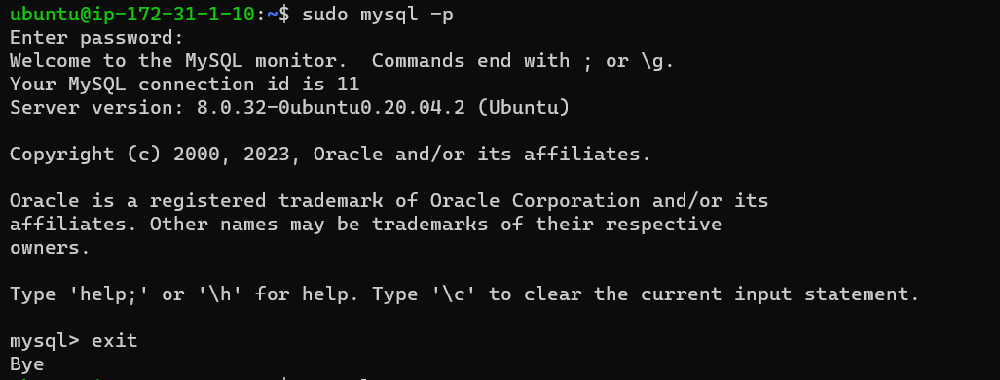
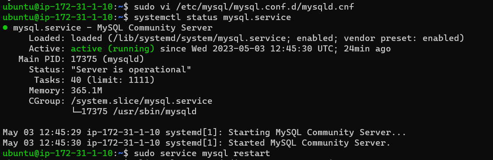

# CLIENT-SERVER ARCHITECTURE WITH MYSQL

## IMPLEMENT A CLIENT SERVER ARCHITECTURE USING MYSQL DATABASE MANAGEMENT SYSTEM (DBMS)

### Create and configure two Linux-based virtual servers EC2 instances in AWS

Server A name - `mysql server`
Server B name - `mysql client`

### update and upgrade for server

`sudo apt update`

`sudo apt upgrade`

### update and upgrade for client server

`sudo apt update`

`sudo apt upgrade`

### installing mysql server on server A

`sudo apt install mysql-server`

`sudo mysql`

`mysql> ALTER USER 'root'@'localhost' IDENTIFIED WITH mysql_native_password BY 'PassWord.1';`

`mysql> exit`

`sudo mysql_secure_installation`

` mysql -u root -p`

`mysql>  CREATE USER 'slushpuppy'@'%' IDENTIFIED BY 'senisafid3';`

`mysql> GRANT ALL PRIVILEGES ON * . * TO 'slushpuppy'@'%';`

`mysql>  FLUSH PRIVILEGES;`

`mysql>  select user,host from mysql.user;`

`mysql> exit`

`sudo vi /etc/mysql/mysql.conf.d/mysqld.cnf` in the bind address I replaced ‘127.0.0.1’ to ‘0.0.0.0’

`:wqa`

`systemctl status mysql.service`

`sudo service mysql restart`

### installing mysql client on server B

`sudo apt-get install mysql-client`

` mysql -u slushpuppy -h 172.31.1.10 -p`

`mysql> Show databases;`
